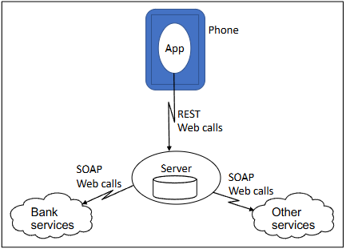

:::::::::::::::::::::::::::::::::::::: questions 

- How do you play the agile security game?
- What are the outcomes of the game?

::::::::::::::::::::::::::::::::::::::::::::::::

::::::::::::::::::::::::::::::::::::: objectives

- For each Agile sprint, discuss and agree amongst yourselves which stories to implemnt.
- Record your chosen sotries for that sprint (write down the code letters).

::::::::::::::::::::::::::::::::::::::::::::::::

## Player Instructions

We’ve got a problem. The MoneyZoom money management app we released last week has gone viral. 
People are downloading it by the tens of thousands; they’re all using it massively, and it’s received thousands of tweets and masses of mentions on every other social network.
Even the Daily Mail newspaper has had an article on it.

Trouble is, we’re a start-up and it was only supposed to be a
limited pilot.
We’ve put in only rudimentary security because we believed it under the radar for any of the likely attackers.
But now we’ve got everyone from celebrities to my grandmother using it to pay for everything from gas bills to online games. AND IT’S NOT SAFE!

{alt='UI of Moneyzoom' style="float:right; width:300px;height:auto"}

As the figure to the right shows, the functionality is all there and works well enough – fantastically done, team!
Your mission now, should you choose to accept it, is to prioritise and implement the security enhancements to the system in the best way to minimise the threat to us and our users.
Are you up for it? 
Let’s start now.

It’s an agile project, of course, with two-week sprints.
So each round in this game is a two week sprint.
And for each sprint you have story cards with options you can take, and the estimated cost for each in estimation units.
Some are security enhancements; some are test actions (the estimates include basic fixes that result from the testing); some are research activities which may lead to further tasks.

You have an initial budget for each sprint of **11 units**, building up as you build up the team to **12 units for sprints 3 onwards**; you can’t go over your budget and of course unused units don’t carry over the next sprint.
You decide what you’ll do and the two weeks go by in a trice. 
And at the end of the sprint you’ll do a release of both app and server, and maybe get some new options opened up by the research you’ve done or the actions you’ve taken in the past.

And in the next sprint, and following sprint you do the same again. 
But remember – we also have a released product out there and maybe attackers will be DOING NASTY THINGS.
Whether they’ll be successful or not depends on what decisions you made.

{alt='Model of Moneyzoom'}

The game has some simplifications in timing.
It ignores the time lag for getting apps from release to deployment.
It assumes a stunningly agile team who can all move easily from server to app and from coding to reviewing to pen testing.
And, remarkably, each task turns out to take exactly the effort estimated!
So, you’ll get feedback on what NASTY THINGS have happened at the end of the sprint when you make each release.

For each sprint, discuss and agree amongst yourselves which stories to implement; record your chosen stories for that sprint (write down the code letters).
The purpose and the learning of the game is in the discussion. 
Once the decisions are made, the game leader will feed back what has happened: any exploits seen during that sprint (of the code in the previous sprint’s release), and any new stories suggested by the learning from that sprint.

## A Little Bit about Moneyzoom

MoneyZoom is an off-banking app. Here’s what I as a user can do with MoneyZoom:

- See the transactions I’ve done
- Change my name, address and contact details
- Transfer money to other MoneyZoom users
- Pay bills to well-known organisations (Utilities, tax)
- Pay money to other people’s bank accounts
- Put in money in from my payment card.

The MoneyZoom app communicates with an ‘App Server’, which itself is connected to banking back ends, the EMV networks, and a variety of other services, as shown in Figure 2.

::::::::::::::::::::::::::::::::::::: keypoints 

- key point 1

::::::::::::::::::::::::::::::::::::::::::::::::

